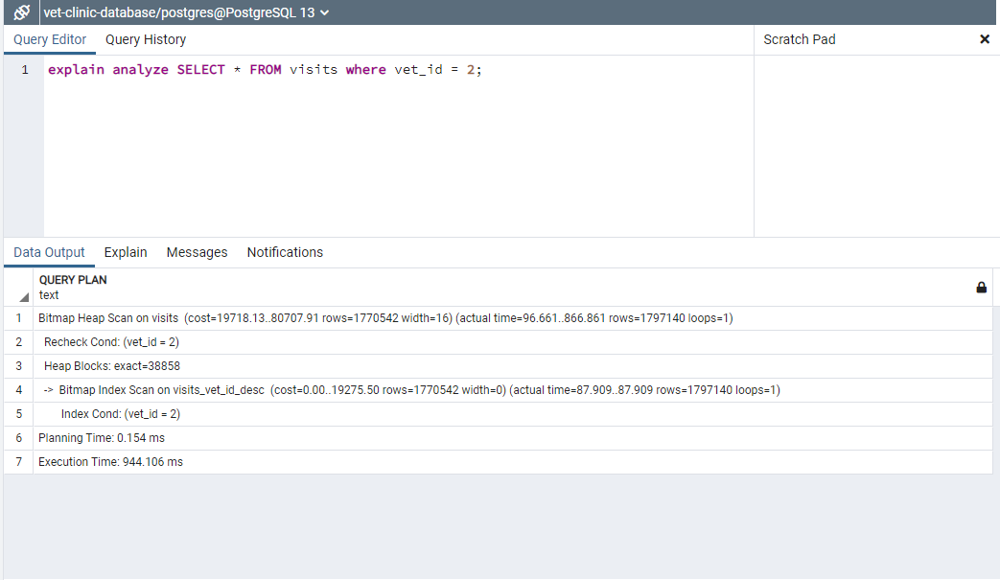

# Vet Clinic Database

> This is a project that we carry out in order to improve the performance of the databases, in it we learned the use of the Index and Denormalization.

## Performance

### Query ```explain analyze SELECT COUNT(*) FROM visits where animal_id = 4;``` before the optimization.


### Query ```explain analyze SELECT COUNT(*) FROM visits where animal_id = 4;``` after the optimization.


### Query ```SELECT * FROM visits where vet_id = 2;``` before the optimization.


### Query ```SELECT * FROM visits where vet_id = 2;``` after the optimization.



### Query ```SELECT * FROM owners where email = 'owner_18327@mail.com';``` before the optimization.


### Query ```SELECT * FROM owners where email = 'owner_18327@mail.com';``` after the optimization.


## Getting Started

This repository includes files with plain SQL that can be used to recreate a database:

- Use [schema.sql](./schema.sql) to create all tables.
- Use [data.sql](./data.sql) to populate tables with sample data.
- Check [queries.sql](./queries.sql) for examples of queries that can be run on a newly created database. **Important note: this file might include queries that make changes in the database (e.g., remove records). Use them responsibly!**


## Authors

👤 **Arístides José Molina Pérez**

- Github: [@aristides1000](https://github.com/aristides1000)
- Twitter: [@aristides_1000](https://twitter.com/aristides_1000)
- Linkedin: [Aristides Jose Molina Perez](https://www.linkedin.com/in/aristides-molina/)

👤 **Yuvraj Manoo**

- GitHub: [@YuvrajjM108](https://github.com/YuvrajM108)
- Twitter: [@YuvrajM108](https://twitter.com/YuvrajM108)
- LinkedIn: [Yuvraj-Manoo](https://linkedin.com/in/yuvraj-manoo)

## 🤝 Contributing

Contributions, issues, and feature requests are welcome!

Feel free to check the [issues page](https://github.com/aristides1000/vet-clinic-database/issues).

## Show your support

Give a ⭐️ if you like this project!

## Acknowledgments

- Ariel Camus CEO Microverse: For letting us start this journey.
- Google: For letting us find crucial information in order to create this project.

## 📝 License

This project is [CC0-1.0](LICENSE) licensed.
